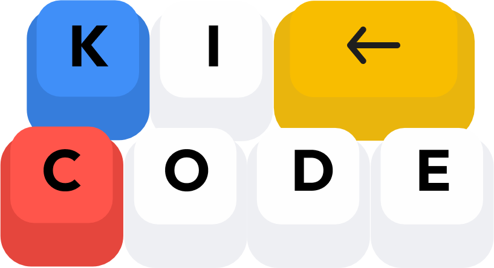

<p align="center">
  
</p>

<h1 align="center">Kicode — Landing Page</h1>

<p align="center">
  <strong>Automatiza tu negocio con IA y nocode.</strong><br/>
  Landing page del servicio Kicode, construida con Astro y Bun.
</p>

<p align="center">
  
  
  
</p>

---

## 📋 Tabla de contenidos

- [Sobre el proyecto](#-sobre-el-proyecto)
- [Tech Stack](#-tech-stack)
- [Requisitos previos](#-requisitos-previos)
- [Instalación](#-instalación)
- [Comandos disponibles](#-comandos-disponibles)
- [Estructura del proyecto](#-estructura-del-proyecto)
- [Componentes](#-componentes)
- [Estilos y diseño](#-estilos-y-diseño)
- [Contribuir](#-contribuir)

---

## 🚀 Sobre el proyecto

**Kicode** es un servicio de automatización para negocios que utiliza herramientas nocode e IA. Esta landing page presenta el servicio y sus beneficios a potenciales clientes.

### Secciones de la landing

| Sección | Descripción |
|---------|-------------|
| **Hero** | Headline principal con carrusel infinito de logos de herramientas (WhatsApp, n8n, Gemini, etc.) |
| **¿Te suena familiar?** | Tarjetas 3D flip que muestran problemas comunes y sus soluciones con Kicode |
| **Beneficios** | Grid de 4 cards con ventajas del servicio (respuesta 24/7, agendamiento, etc.) |
| **Cómo funciona** | Flujo de 4 pasos que explica el proceso de automatización |
| **Recursos gratuitos** | Guías y templates para los visitantes |
| **FAQ** | Preguntas frecuentes con acordeón interactivo |
| **Contacto** | Formulario de solicitud de demo + métodos de contacto |
| **Footer** | Links de navegación, redes sociales y branding |

> **Nota:** El proyecto está en su **v1 (estructura)**. En la v2 se planea refactorizar la landing completa.

---

## 🛠 Tech Stack

| Tecnología | Uso |
|-----------|-----|
| [Astro](https://astro.build/) v5.17 | Framework web (SSG) |
| [Bun](https://bun.sh/) | Runtime y gestor de paquetes |
| TypeScript | Tipado estricto |
| Vanilla CSS | Estilos con custom properties |
| Google Fonts | Outfit, DM Sans, Caveat |

---

## 📦 Requisitos previos

- [Bun](https://bun.sh/) (recomendado) **o** [Node.js](https://nodejs.org/) v18+
- Git

### Instalar Bun

```bash
# Windows (PowerShell)
irm bun.sh/install.ps1 | iex

# macOS / Linux
curl -fsSL https://bun.sh/install | bash
```

---

## ⚡ Instalación

```bash
# 1. Clonar el repositorio
git clone https://github.com/jcbalbdev/kicode.git
cd kicodeweb

# 2. Instalar dependencias
bun install

# 3. Iniciar servidor de desarrollo
bun dev
```

El sitio estará disponible en **http://localhost:4321**

---

## 🧞 Comandos disponibles

Todos los comandos se ejecutan desde la raíz del proyecto (`kicodeweb/`):

| Comando | Descripción |
|---------|-------------|
| `bun install` | Instala las dependencias |
| `bun dev` | Inicia el servidor de desarrollo en `localhost:4321` |
| `bun build` | Genera el sitio de producción en `./dist/` |
| `bun preview` | Previsualiza el build de producción localmente |
| `bun astro ...` | Ejecuta comandos del CLI de Astro |

---

## 📁 Estructura del proyecto

```
kicodeweb/
├── public/                    # Assets estáticos (servidos tal cual)
│   ├── favicon.ico
│   ├── favicon.svg
│   ├── logo-kicode.png
│   ├── logo-kicode-v2.png
│   ├── tarjeta1.png           # Imagen para ProblemCard
│   └── icon*.png              # Iconos de herramientas (WhatsApp, n8n, etc.)
│
├── src/
│   ├── assets/                # Assets procesados por Astro
│   │   ├── astro.svg
│   │   └── background.svg
│   │
│   ├── components/            # Componentes reutilizables (.astro)
│   │   ├── Header.astro
│   │   ├── Hero.astro
│   │   ├── Button.astro
│   │   ├── ProblemCard.astro
│   │   ├── FeatureCard.astro
│   │   ├── ResourceCard.astro
│   │   ├── FAQItem.astro
│   │   ├── KeyboardButton.astro
│   │   └── Welcome.astro
│   │
│   ├── layouts/
│   │   └── Layout.astro       # Layout principal (SEO, meta tags, OG)
│   │
│   └── pages/
│       └── index.astro        # Página principal (landing completa)
│
├── astro.config.mjs           # Configuración de Astro
├── tsconfig.json              # TypeScript (strict mode)
├── package.json
└── bun.lock
```

---

## 🧩 Componentes

Cada componente es un archivo `.astro` autocontenido con su markup, lógica y estilos encapsulados (scoped CSS).

| Componente | Descripción | Props |
|-----------|-------------|-------|
| `Layout.astro` | Layout base con `<head>`, SEO y meta tags | `title`, `description?` |
| `Header.astro` | Navegación principal con logo | — |
| `Hero.astro` | Sección hero con headline animado y carrusel de logos | — |
| `Button.astro` | Botón reutilizable con variantes | `variant`, `href` |
| `ProblemCard.astro` | Tarjeta 3D flip (problema → solución) | `image`, `icon`, `title`, `description`, `solution` |
| `FeatureCard.astro` | Card de característica | `icon`, `title`, `description` |
| `ResourceCard.astro` | Card de recurso gratuito | `icon`, `title`, `description`, `tag` |
| `FAQItem.astro` | Acordeón de pregunta/respuesta | `question`, `answer` |

---

## 🎨 Estilos y diseño

El proyecto utiliza **vanilla CSS** con un sistema de custom properties definido en `index.astro`:

```css
:root {
  /* Paleta principal (basada en el logo) */
  --color-primary: #2563eb;
  --color-primary-dark: #1d4ed8;
  --color-primary-light: #60a5fa;
  --gradient-blue: linear-gradient(135deg, #2563eb 0%, #60a5fa 100%);

  /* Colores base */
  --color-bg: #ffffff;
  --color-text: #1d1d1f;
  --color-text-secondary: #6e6e73;

  /* Spacing */
  --spacing-xs: 0.5rem;
  --spacing-sm: 1rem;
  --spacing-md: 2rem;
  --spacing-lg: 4rem;
  --spacing-xl: 6rem;
}
```

### Convenciones de estilos

- Los estilos son **scoped** por componente (Astro los encapsula automáticamente)
- Los estilos globales de la página se definen en `index.astro`
- Se usan **radial-gradient** para los fondos de sección
- Responsive con breakpoints: `768px` (tablet), `480px` (mobile), `360px` (small mobile)

---

## 🤝 Contribuir

¡Las contribuciones son bienvenidas! Sigue estos pasos:

### 1. Fork y clona

```bash
# Ve a https://github.com/jcbalbdev/kicode y haz click en "Fork"
git clone https://github.com/<tu-usuario>/kicode.git
cd kicodeweb
bun install
```

### 2. Crea una rama

```bash
git checkout -b feature/nombre-descriptivo
```

### 3. Haz tus cambios

- Asegúrate de que el proyecto compila sin errores: `bun build`
- Prueba visualmente en el servidor de desarrollo: `bun dev`
- Verifica que el sitio se vea bien en mobile y desktop

### 4. Commit y Push

```bash
git add .
git commit -m "feat: descripción breve del cambio"
git push origin feature/nombre-descriptivo
```

### 5. Abre un Pull Request

Describe los cambios realizados e incluye capturas de pantalla si modificaste algo visual.

### Lineamientos generales

- ✅ Mantén los componentes pequeños y reutilizables
- ✅ Usa las custom properties de CSS existentes (no hardcodees colores)
- ✅ Sigue la estructura de archivos actual
- ✅ Asegúrate de que todo sea responsive
- ❌ No instales dependencias sin discutirlo antes
- ❌ No modifiques la configuración de Astro sin consenso

---

<p align="center">
  Hecho con ❤️ por el equipo de <strong>Kicode</strong> — © 2026
</p>
